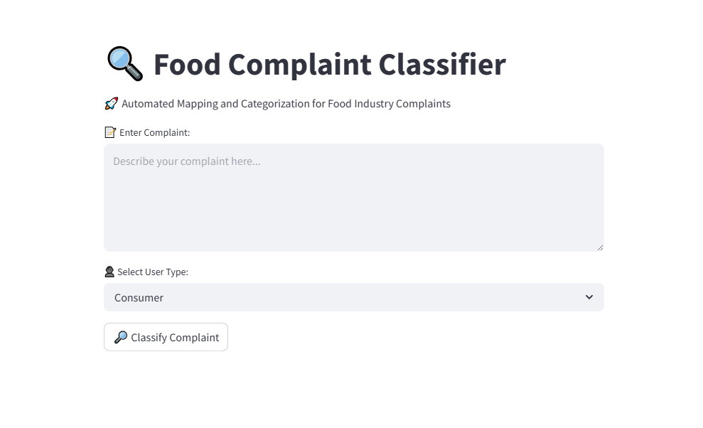

# Automated_Mappingand_Categorisation
This project is an automated complaint classification system for the food industry. It maps complaints to relevant departments and user-specific categories using Natural Language Processing (NLP) and Machine Learning

# 🍏 Food Complaint Classification System

This project is an **automated classification system** for food-related complaints. It classifies complaints into relevant **food departments** and **user-specific categories** using Machine Learning and Natural Language Processing (NLP). The system is built with **Python**, **scikit-learn**, and **Streamlit**.

---

## 🚀 Features

- ✅ **Automated Mapping to Departments**
  - Food Safety
  - Quality Control
  - Packaging
  - Labeling
  - Customer Service

- ✅ **Tailored User-Specific Categories**
  - Consumer: Safety Concern, Product Quality, Packaging Issue, Customer Service
  - Retailer: Supply Issue, Wholesale Quality, Delivery Problem, Billing
  - Supplier: Raw Material Quality, Contract Terms, Payment Delay, Logistics

- ✅ **Interactive Streamlit Web Interface**
  - Classify new complaints
  - Train the model with custom or sample data
  - Evaluate classifier performance
  - Visual confidence levels for predictions

---

## UI 
## 📸 Screenshot

